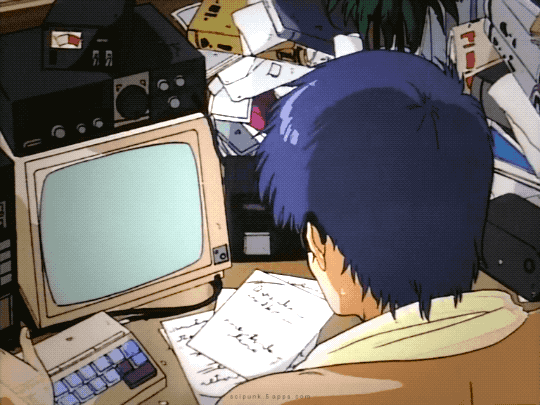

# Welcome! I’m Enzo Magioli, it's nice to see you here!

- 👀 I’m interested in Mathematics, Videogames, Playing instruments, Learning & Teaching!
- 🌱 I’m currently learning C#, Javascript, HTML, CSS and Japanese!
- 😄 The pronouns are He/Him/His

##

  <a href="https://github.com/emagioli">
  
  

 
 
 
 
 
  
  
  
  
  
  
  

 ##
 

 
 
 
 

 
 
 
  
    

<!---
emagioli/emagioli is a ✨ special ✨ repository because its `README.md` (this file) appears on your GitHub profile.
You can click the Preview link to take a look at your changes.
--->
